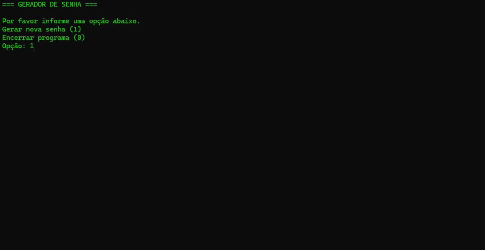
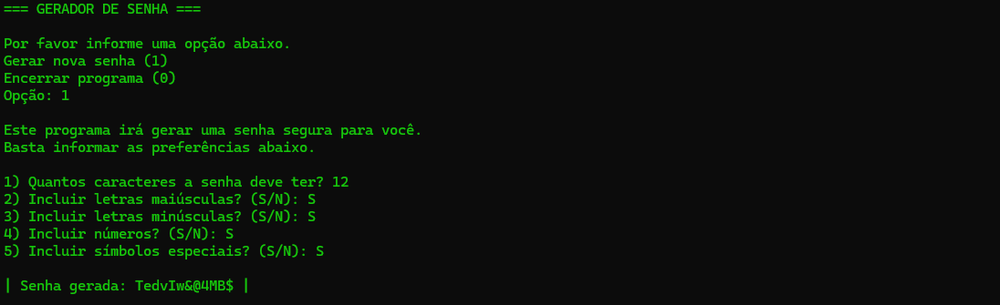
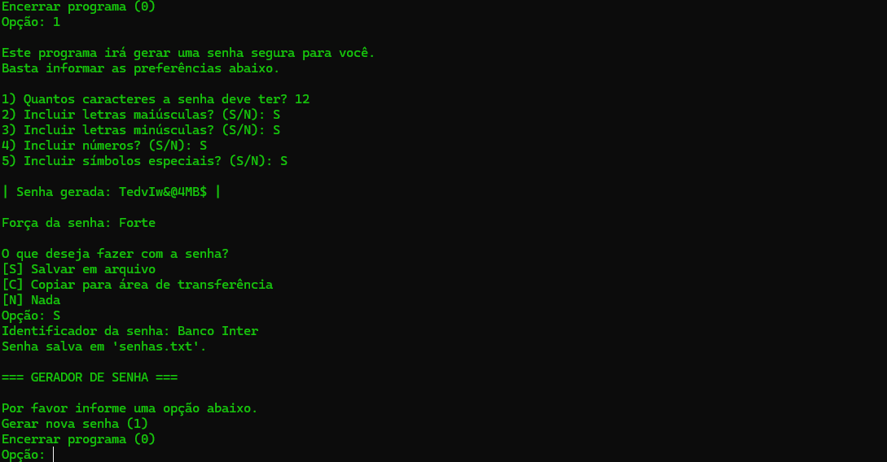
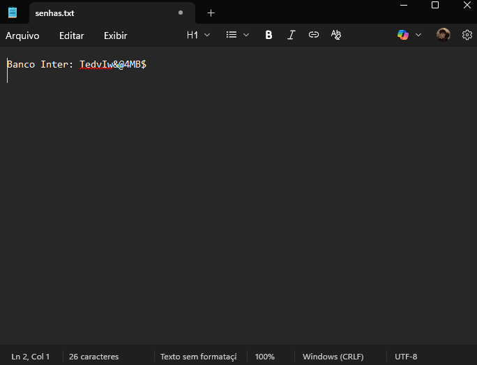

# 🔐 Gerador de Senhas em C

Um gerador de senhas personalizável escrito em C.  
Permite criar senhas seguras com opções de letras maiúsculas, minúsculas, números e símbolos.  
Conta também com salvamento em arquivo `.txt`, cópia direta para a área de transferência e um medidor simples de força da senha.

---

## 🚀 Funcionalidades
- Definir comprimento da senha (5–15 caracteres).
- Personalizar tipos de caracteres (maiúsculas, minúsculas, números, símbolos).
- Medidor de força da senha (fraca / média / forte).
- Salvar senhas em um arquivo `.txt` com identificadores.
- Copiar senhas diretamente para a área de transferência.
- Interface simples e interativa no terminal.

---
## 📸 Capturas de Tela

### 1. Menu Inicial


### 2. Personalização da Senha


### 3. Senha Gerada + Medidor de Força + Opções Após Gerar a Senha


### 5. Exemplo de Arquivo `senhas.txt`



---

## 🛠️ Compilação

Para compilar, use o `gcc`:

```bash
gcc password.c -o password.exe
```
## ▶️ Uso

Execute o programa:

```bash
password.exe
./password
```
Depois, basta seguir as instruções no terminal.

Exemplo de fluxo:
- Escolher gerar nova senha.
- Informar tamanho e preferências de caracteres.
- Copiar para o clipboard ou salvar no `.txt` com um identificador.

## 📂Exemplo de senhas salvas

Se optar por salvar, será criado/atualizado um arquivo `senhas.txt`:

```bash
Senha Banco Santander: KSN%32FS@@
Email Pessoal: p@ssW0rd!
```

## 📊Medidor de força

A força da senha é avaliada de acordo com:
- Comprimento
- Diversidade de caracteres

O resultado exibido será:
- Fraca
- Média
- Forte

## 🤝Contribuindo

Sinta-se à vontade para dar fork e enviar pull requests.
Sugestões e melhorias são muito bem-vindas!

## 📜Licença

Este projeto está sob a licença MIT.
  

  

